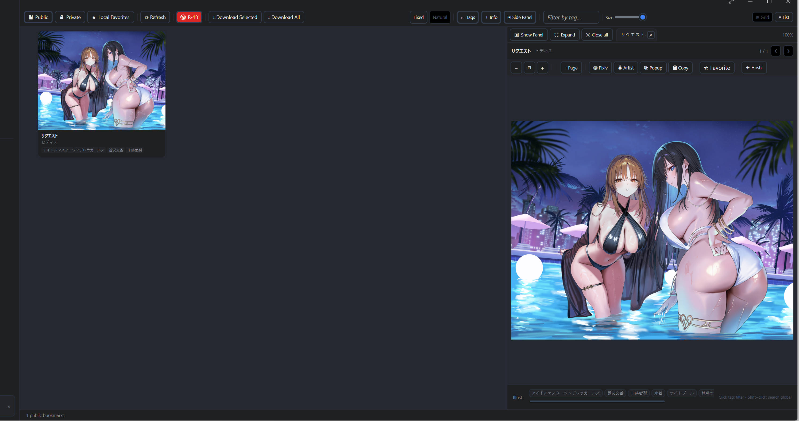
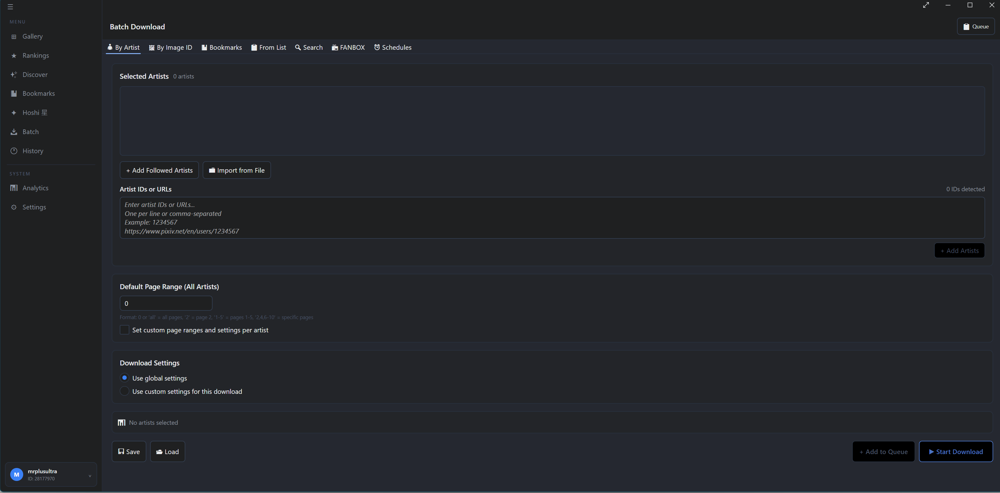
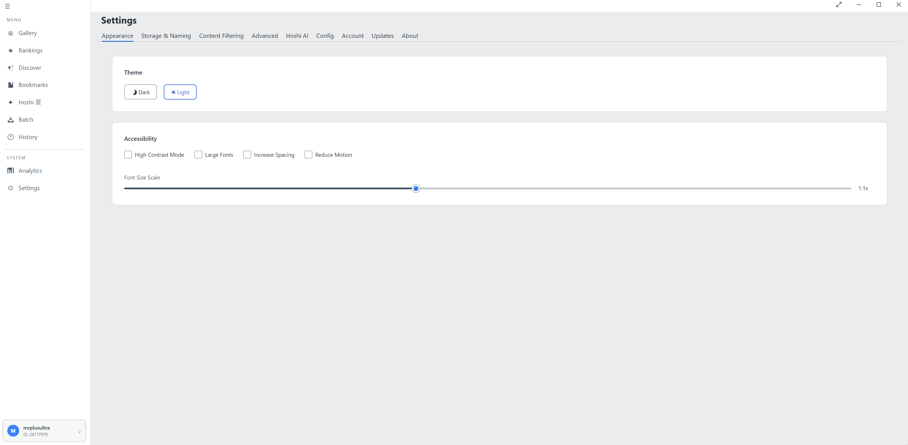

<div align="center">
  
  <h1>Pixora · ピクラ</h1>
  <p>A modern desktop manager for Pixiv artwork — browse, download, schedule, and organise your collection.</p>

  [](https://github.com/pikura-app/pixora/releases/latest)
  [](LICENSE)
  [](https://dotnet.microsoft.com)
  [](#download)

  <br/>

  [](https://ko-fi.com/mrplusultra)
  [](https://www.patreon.com/mrplusultra/join)

  <br/>
</div>

---

## Screenshots


<div align="center">
  
  <br/><br/>
  
  
</div>

---

## Features

- **Gallery browser** — browse your Pixiv feed, bookmarks, and followed artists
- **Side panel** — expand any artwork inline with metadata, tags, and quick actions (Prev/Next, Artist, Popup, Copy, Favorite, Hoshi)
- **Rankings** — browse daily/weekly/AI/male/female Pixiv rankings with grid or list view
- **Batch download** — download entire artist galleries or bookmark collections in one click
- **Schedules** — set recurring auto-downloads with per-schedule content filters
- **Content filters** — skip AI-generated, Manga, Ugoira, R-18, R-18G content
- **Tag filters** — include/exclude artworks by tag
- **FANBOX support** — download FANBOX posts alongside Pixiv artwork
- **Multi-account** — switch between multiple Pixiv accounts from the sidebar
- **Per-account settings** — override download root, templates, and filters per account
- **Hoshi AI** — ask questions about artworks using a local Ollama vision model
- **Auto-updater** — checks for updates on startup, downloads and installs with one click
- **System tray** — runs quietly in the background
- **Themes** — light and dark mode

## Download

| Platform | Installer | Portable |
|----------|-----------|----------|
| **Windows** | [Pixora-Setup.exe](https://github.com/pikura-app/pixora/releases/latest) | [.zip](https://github.com/pikura-app/pixora/releases/latest) |
| **macOS** | [Pixora.dmg](https://github.com/pikura-app/pixora/releases/latest) | — |
| **Linux** | [.AppImage](https://github.com/pikura-app/pixora/releases/latest) | [.tar.gz](https://github.com/pikura-app/pixora/releases/latest) |

> **macOS note:** Pixora is not notarised. On first launch right-click → Open to bypass Gatekeeper.

## Requirements

- A Pixiv account
- Windows 10+, macOS 12+, or a modern Linux distro
- No separate .NET installation needed — the download is self-contained

## Building from source

**Prerequisites:** [.NET 10 SDK](https://dotnet.microsoft.com/download)

```bash
git clone https://github.com/pikura-app/pixora.git
cd pixora
dotnet build src/Pixora.Avalonia/Pixora.Avalonia.csproj
dotnet run --project src/Pixora.Avalonia/Pixora.Avalonia.csproj
```

## Project structure

```
src/
  Pixora.Core/        # Business logic, API clients, download services
  Pixora.Avalonia/    # Avalonia UI — views, viewmodels, assets
tools/
  MakeIco/            # CLI tool to generate pixora.ico from SVG
  installer/          # Inno Setup script for Windows installer
  convert-icon.ps1    # SVG → ICO helper script
.github/workflows/
  release.yml         # CI — builds & publishes all platforms on git tag
```

## Releasing

```bash
git tag v1.0.0
git push origin v1.0.0
```

GitHub Actions builds Windows (installer + portable), macOS (DMG), and Linux (AppImage + tar.gz) automatically and attaches them to the release.

## License

MIT — see [LICENSE](LICENSE). Free for personal, non-commercial use.
